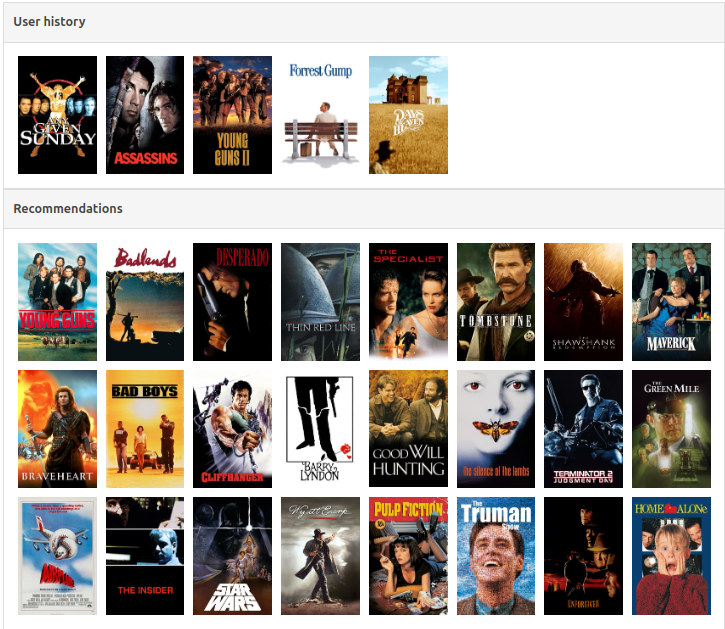
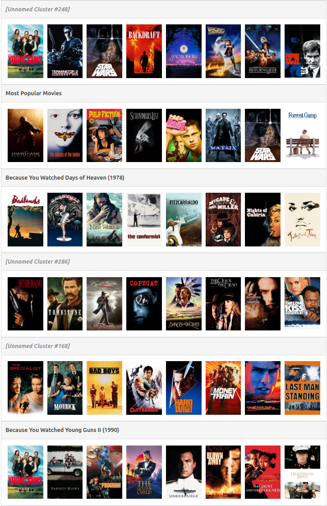

# Full Page Recommender

The Full Page Recommender (FPR) delivers personalized pages with collections
of items instead of a single list. Relevant collections appear at the top,
using soft de-duplication to showcase the catalog and encourage users to
explore beyond their typical interests.

A collection is a labeled group of scored items. Collections can maintain
fixed item orders, useful for static lists like _"Top 10 Books This Week."_

An item's score reflects its relevance to both the user and the collection.
For example, [_"Zombieland"_][zombieland-wiki] might score higher in _"Comedy
Movies"_ than in _"Post-Apocalyptic Movies"_ due to audience preferences.

Scores can be derived from one or multiple recommendation models. For
example, metadata-based models could handle _"Just Released"_ collections,
while rating-based models fit others. FPR doesn’t include a model yet, but
there are plans to add [EASE][ease-arxiv] and tools for auto-generating
collections using Node2Vec embedding and nested clustering.

## Key Features

### Item Relevancy

FPR recommendations are based on any provided model, ensuring relevance to
users. Multiple models can be combined for different use cases.

### Promotes Depth of Catalog

Top-ranked items appear prominently, while the bottom presents the broader
catalog. This approach ensures users see the full range of genres or
categories. For instance, comedy fans might see rows like _"Raunchy Comedies,"_
_"Animated Comedy,"_ and _"Trending Comedies"_ across the page, while others
receive only a single _"Comedies"_ row.

### Popularity-Based and Editorial-Curated Collections

Collections can highlight trending or seasonal interests, such as _"Holiday
Favorites"_ or _"Top Picks in Your Region,"_ using popularity signals from
other users. Editors can also manually curate collections to promote key
content.

These collections can be generated using a separate model and provided to
FPR. Items can be displayed in popularity order or re-sorted based on the
user's preferences. Each collection is ranked against others and placed on
the page accordingly.

### Item De-Duplication

De-duplication leverages item "temperatures." When an item appears in a
collection, its temperature increases, reducing its score for future rows.
This ensures items can appear in multiple rows but remain evenly distributed.

### Dynamic Parametrization

Recommendations can be fine-tuned using a combination of parameters. This
enables the model to focus on highly relevant, personalized content or
promote catalog diversity by exposing various genres. It also controls the
degree of item de-duplication.

Parameters can be set globally for the entire page or vary smoothly from top
to bottom. For example, the top of the page may prioritize personalization,
while the bottom highlights unexplored content.

### Device-Specific Recommendations

Different devices display varying numbers of items without scrolling. FPR
supports position-based scoring to optimize recommendations for different
screen sizes.

## Example

Here's an example using MovieLens dataset and EASE model for personalized 
item scoring. Assume, there is a user with following watch history. The 
linear recommendations for such user would look like this.



When we combine the same recommendation algorithm with FPR, we get following 
structure of recommendations. (Only the first six rows out of 30-row page are 
displayed here.)



Some rows are currently unnamed. The automatic labeling of cluster is 
currently being researched. Just looking at the movie posters, one can 
create some labels manually:

- #248: Action
- #286: Western
- #168: Police Thriller


## Try It Yourself

Get the repo locally:

```shell
git clone git@github.com:jankislinger/full-page-recommender.git
cd full-page-recommender
```

Run example in Python:

```shell
poetry shell
poetry install --no-root
maturin develop
python main.py
```

Run example blazingly fast in Python:

```shell
maturin develop --release
python main.py
```

[ease-arxiv]: https://arxiv.org/abs/1905.03375

[zombieland-wiki]: https://en.wikipedia.org/wiki/Zombieland
